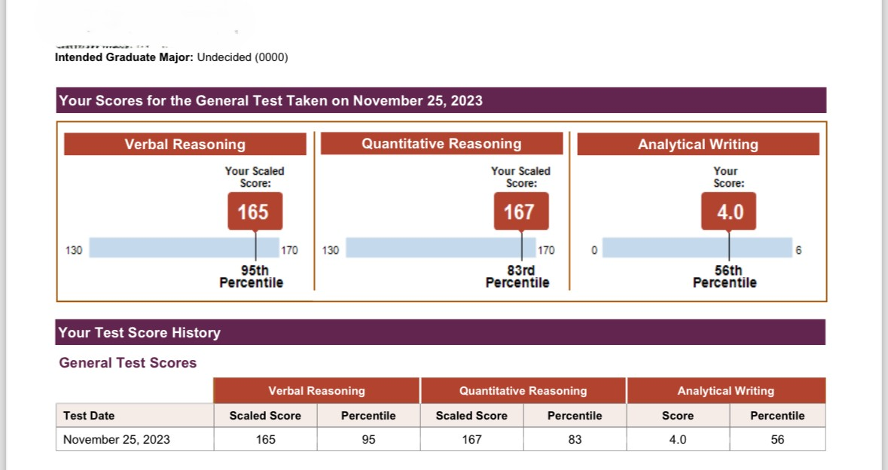
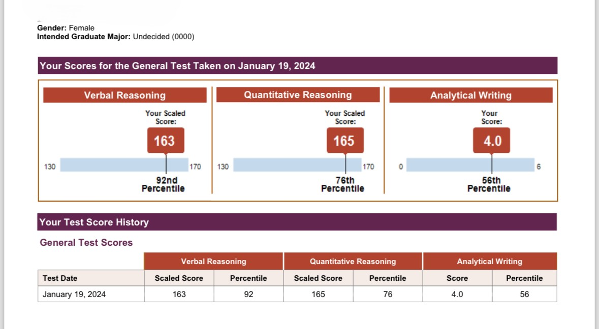
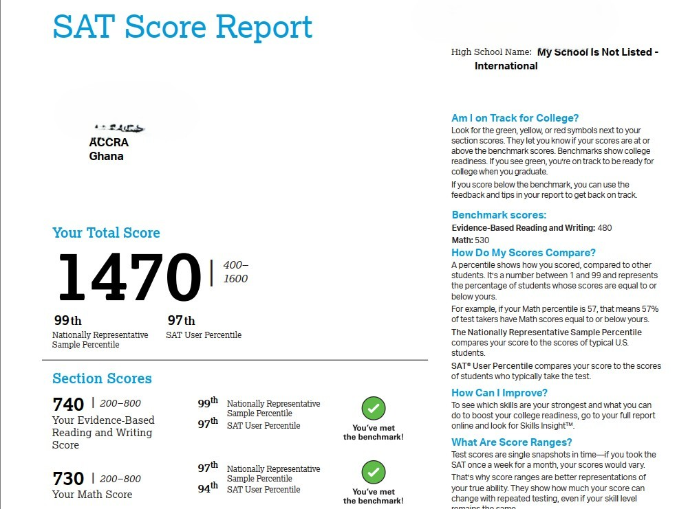
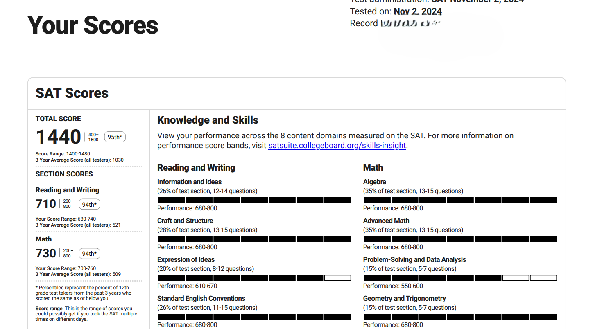

## 🧰 Tech Toolbox

---

<h2 align="center">Hi there 👋 - I'm Emmanuel, but everyone calls me <strong>Penod</strong>.</h2>
<h3 align="center">🎯 Data Scientist | AI/ML Engineer </h3>

  
  
  

---

### 👨‍💻 About Me

- 🔭 Currently pursuing **MSc in Mathematics & Statistics** at Stephen F. Austin State University  
- 💡 Passionate about **machine learning**, **data visualization**, and **statistical modeling**
- 🤝 Open to **collaboration** and **freelance projects**
- 🧠 Interests: **HealthTech**, **FinTech**, **Cloud AI**, **Tutoring** and **Volunteerism**

---

### 🛠️ Tech Stack

**Languages:**  
`Python` | `R` | `SQL` | `MATLAB`

**Visualization:**  
`Tableau` | `Power BI` | `Matplotlib` | `ggplot2` | `Plotly` | `Seaborn`

**Databases & Big Data:**  
`MySQL` | `MongoDB` | `BigQuery` | `PySpark` | `Hadoop`

**ML & Tools:**  
`Scikit-learn` | `TensorFlow` | `XGBoost` | `ARIMA`  
`Streamlit` | `MLflow` | `Git`

**Cloud & Platforms:**
`AWS` | `Google Cloud` | `GitHub` 

---

## 💻 Projects

### 🧠 Credit Card Customer Segmentation

Applied unsupervised learning (K-Means clustering) to segment credit card customers by demographics, spending behavior, and credit usage.
Identified key customer profiles to support targeted marketing and product personalization strategies.

**Tech Stack**: Python, Pandas, Scikit-learn, Seaborn

[View Project](https://github.com/Penod/Credit_Card_Customer_Segmentation)

### ❤️ Heart Failure Prediction using Machine Learning
Built a machine learning pipeline to predict heart failure outcomes using clinical features.  
Performed exploratory data analysis, applied multiple classifiers, and evaluated model performance using accuracy, precision, recall, and F1-score.  
**Tech Stack**: Python, Scikit-learn, Pandas, Matplotlib, Seaborn  
[View Project](https://github.com/Penod/heartanalysis)

### 📈 Time Series Forecasting of Apple Stock (AAPL)
Performed trend and seasonal analysis on Apple stock prices using **ARIMA** and **ETS** models.  
Evaluated model fit, residual diagnostics, and forecasted future prices with confidence intervals.  
**Tech Stack**: R, Forecast, Tidyverse, Tseries, ggplot2  
[View Project](https://github.com/Penod/AAPL-Time-Series-Analysis)

### 🧬 Batch Effect Correction in Gene Expression Data 
Performed end-to-end analysis to identify and correct batch effects in gene expression data using the `ComBat` algorithm. Assessed confounding between batch and biological condition (cancer status), visualized PCA (2D & 3D), and applied model-based correction to preserve biological signals. Delivered a reproducible `.Rmd` project with visual insights and explanations.  
**Tech Stack:** R, sva, ggplot2, plotly, viridis, Bioconductor  
[View Project](https://github.com/Penod/gene-expression-batch-correction)

### 🚗 Forecasting U.S. Vehicle Sales  
Forecasted vehicle sales in the U.S. using ARIMA modeling and interactive Plotly visualizations.  
**Tech Stack**: Python, Pandas, Statsmodels, Plotly  
[View Project](https://github.com/Penod/Forecasting-us-vehicle-sales)

---

## 🏆 Certifications

---

### 📚 Publication

**Pharmacophore-Guided Identification of Natural Products**  
*MDPI, Computation Journal*  
🔗 [Read Publication](https://doi.org/10.3390/computation9030032)

---

### 🧠 Recent Roles

- **Graduate Research/Teaching Assistant** – SFASU (2023–Now)  
  → ML model on 40,000+ students, IT support, and lab mentoring  
- **Data Analyst** – EmPen Data Consulting (2023)  
  → Predictive modeling, time series forecasting, Tableau dashboards  

- **Tutor** – Ace Test Prep (2021–2022)  
  → Mentored **200+ students** preparing for GRE, SAT, and GMAT exams  
  → Helped students consistently score in the **top 10–15 percentile** across all sections  
  → Personalized coaching approach led to a **40% average improvement** in mock test scores  
  → Below are several verified student score reports showcasing consistent high performance:
  
  
  
  *Score: Quant 167*

  
  
  *Score: Quant 165*

  
  
  *Score: Math 730*

  

  *Score: Math 730*

### 🤝 Let's Connect

📫 Email: [emmanueldonkoh335@gmail.com](mailto:emmanueldonkoh335@gmail.com)  
🔗 LinkedIn: [linkedin.com/in/emmanuel-donkoh](https://www.linkedin.com/in/emmanuel-donkoh)  
🌍 Portfolio & More: [Kaggle](https://www.kaggle.com/penod1z)

---

<i>"Data is the oil of the 21st century, but insight is the engine."</i>

